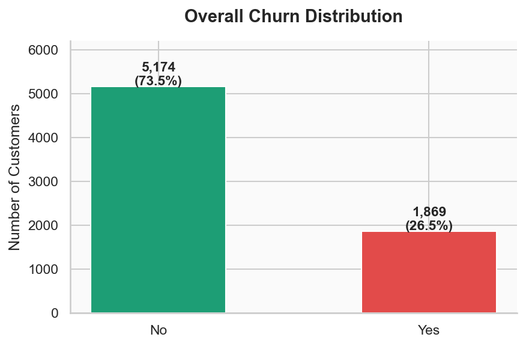
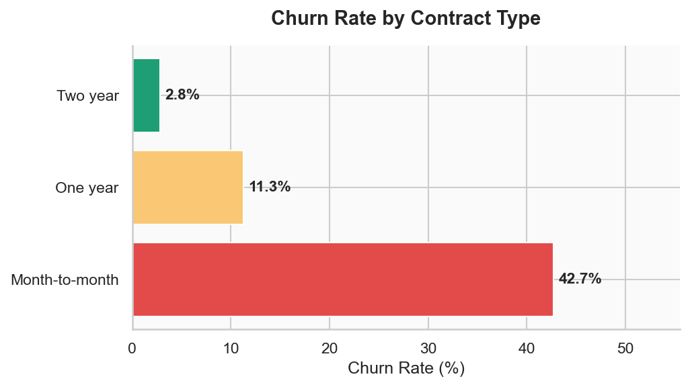
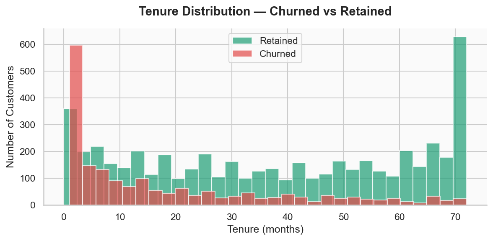
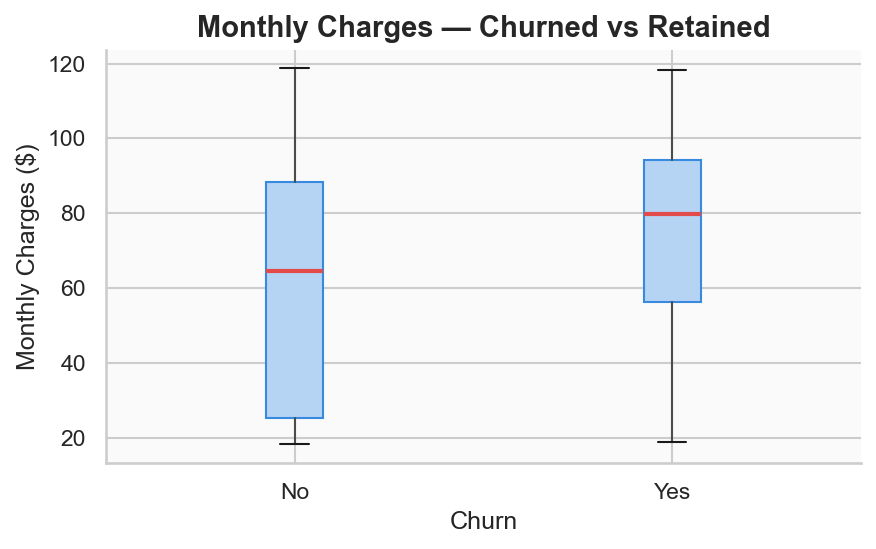
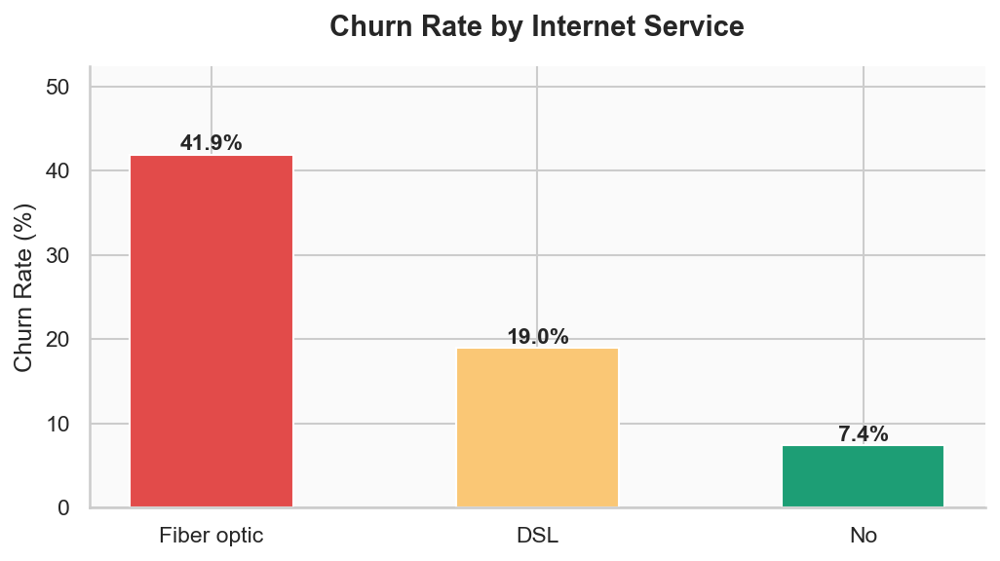
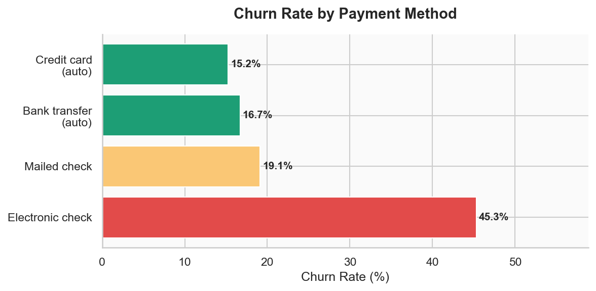
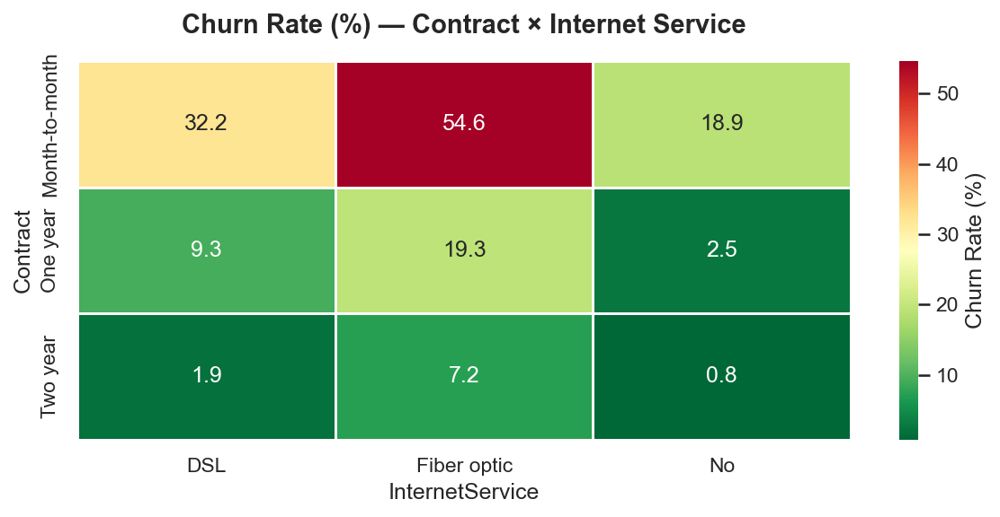

# Customer Churn Analysis

A comprehensive data analytics project that identifies customer churn patterns and generates actionable business intelligence through automated dashboards, visualizations, and executive reports.

---

## 📋 Table of Contents

- [Overview](#-overview)
- [Key Features](#-key-features)
- [Installation](#-installation)
- [Quick Start](#-quick-start)
- [Usage Guide](#-usage-guide)
- [Key Metrics](#-key-metrics)
- [Contributing](#-contributing)

---

## 🎯 Overview

<<<<<<< HEAD
---

## Dashboard Preview
=======
This project analyzes customer churn data to uncover patterns, identify at-risk customers, and provide strategic recommendations. It leverages Python data science tools to generate professional reports, interactive dashboards, and executive presentations.

**What it does:**
- Analyzes 7,043+ customer records
- Identifies 26.5% churn rate with \/month revenue at risk
- Generates 8 publication-ready visualizations
- Creates interactive HTML dashboard
- Exports data for Power BI analysis
- Generates executive PowerPoint presentations
- Produces comprehensive Excel reports
>>>>>>> b13575a (docs: upgrade to professional GitHub standards)

### Churn Distribution

### Churn by Contract Type

### Tenure Distribution

### Monthly Charges

### Churn by Internet Service

### Churn by Payment Method

### Churn Heatmap

---

## ✨ Key Features

### 1. Automated Data Pipeline
- Load and validate customer churn data
- Calculate 11+ key performance indicators
- Generate statistical summaries

### 2. Professional Visualizations (8 charts)
- Churn distribution analysis
- Churn by contract type
- Tenure analysis
- Monthly charges distribution
- Service type impact analysis
- Payment method correlation
- Feature correlation heatmap
- KPI summary card

### 3. Multi-Format Reporting
- **Excel**: Detailed reports with multiple sheets
- **PowerPoint**: Executive presentation
- **HTML**: Interactive responsive dashboard
- **Power BI**: CSV dataset for BI tools

### 4. Interactive Applications
- **Streamlit Dashboard**: Real-time filtering
- **SQL Pipeline**: Automated data processing

---

## 📁 Project Structure

\\\
customer-churn-analysis/
├── Data/
│   └── customer churn.csv
├── dashboard_output/
├── visuals/
├── dashboard_automation.py
├── app.py
├── requirements.txt
├── README.md
├── CONTRIBUTING.md
├── CODE_QUALITY.md
├── CHANGELOG.md
└── .gitignore
\\\

---

## 📦 Requirements

- **Python**: 3.11+
- **RAM**: 2GB minimum
- **Disk Space**: 500MB

---

## 🚀 Installation

### Step 1: Clone Repository
\\\ash
git clone https://github.com/sabarias1999/customer-churn-analysis.git
cd customer-churn-analysis
\\\

### Step 2: Create Virtual Environment
\\\ash
# Windows
python -m venv venv
venv\Scripts\activate

# macOS/Linux
python3 -m venv venv
source venv/bin/activate
\\\

### Step 3: Install Dependencies
\\\ash
pip install -r requirements.txt
\\\

---

## ⚡ Quick Start

### Run Complete Analysis
\\\ash
python dashboard_automation.py
\\\

### Launch Interactive Dashboard
\\\ash
streamlit run app.py
\\\

---

## 📊 Key Metrics

### Customer Metrics
- Total Customers: 7,043
- Churned: 1,869 (26.5%)
- Retained: 5,174 (73.5%)
- High-Risk: 916 customers

### Revenue Metrics
- Total Monthly Revenue: \,117
- Revenue at Risk: \,131/month
- Revenue Retention: 69.5%

---

## 🤝 Contributing

Contributions are welcome! See [CONTRIBUTING.md](CONTRIBUTING.md) for guidelines.

---

## 📄 License

Licensed under MIT License

---

<<<<<<< HEAD
*Built by [Sabari A S](https://linkedin.com/in/sabari3299) · Open to Data Analyst roles*
=======
## 📬 Contact

- **Email**: sabariisalive@gmail.com
- **LinkedIn**: [sabari3299](https://linkedin.com/in/sabari3299)
- **GitHub**: [sabarias1999](https://github.com/sabarias1999)

---

**Last Updated:** June 2, 2024 | **Version:** 2.0.0
>>>>>>> b13575a (docs: upgrade to professional GitHub standards)
